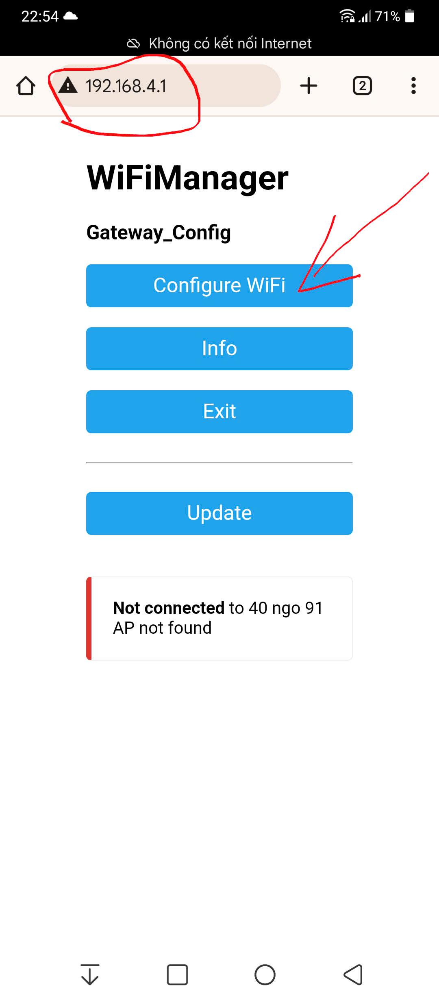
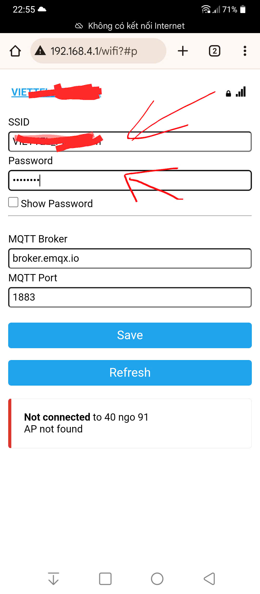
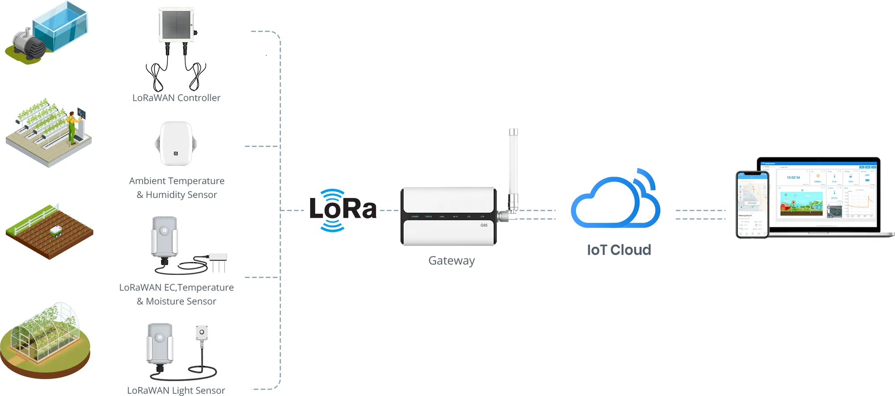

# 1. Cấu Hình Nạp Code ESP32

Trước khi triển khai, cần cấu hình các thông số sau trong file `config.h`:

```c
#define GATEWAY_MAC "001122334455"      // Địa chỉ MAC (6 byte) của Gateway: dang hexa string, viết hoa, liền nhau, không dấu :
#define MAX_DEVICES 100     // Số lượng tối đa thiết bị được quản lý bởi Gateway
#define LORA_RX 16  // Chân RX của LoRa kết nối với TX ESP32
#define LORA_TX 17  // Chân TX của LoRa kết nối với RX ESP32
```

## 1.1. Giải Thích Cấu Hình
- `GATEWAY_MAC`: Địa chỉ MAC của Gateway, cần được thiết lập đúng để các thiết bị có thể giao tiếp với Gateway.
- `MAX_DEVICES`: Số lượng thiết bị tối đa mà Gateway có thể quản lý, giúp giới hạn bộ nhớ và tối ưu hiệu suất.
- `LORA_RX`: Chân GPIO trên ESP32 kết nối với chân TX của module LoRa, dùng để nhận dữ liệu.
- `LORA_TX`: Chân GPIO trên ESP32 kết nối với chân RX của module LoRa, dùng để gửi dữ liệu.

# 2. Hướng Dẫn Cấu Hình WiFi Cho ESP32

Khi ESP32 không kết nối được mạng WiFi, nó sẽ chuyển sang chế độ AP mode để người dùng có thể cấu hình lại mạng WiFi. Dưới đây là các bước thực hiện:

## 2.1. ESP32 Chuyển Sang AP Mode

- Nếu ESP32 không thể kết nối với mạng WiFi đã lưu trước đó, nó sẽ tự động chuyển sang chế độ AP mode.
- WiFi AP sẽ có các thông tin sau:
  - **Tên WiFi (ESSID):** `Gateway_Config`
  - **Mật khẩu:** `12345678`

## 2.2. Kết Nối Vào WiFi Cấu Hình

- Người dùng sử dụng smartphone hoặc laptop để kết nối vào mạng WiFi `Gateway_Config`.

## 2.3. Truy Cập Giao Diện Cấu Hình

- Mở trình duyệt web và nhập địa chỉ **`192.168.4.1`**.
- Giao diện cấu hình WiFi sẽ xuất hiện.

## 2.4. Nhập Thông Tin WiFi Mới

- Nhấn vào nút **Configuration WiFi**.
- Nhập tên WiFi (SSID) và mật khẩu của mạng WiFi mà ESP32 cần kết nối.
- Tùy chọn: Nhập địa chỉ và cổng của MQTT Broker mà Gateway kết nối (mặc định kết nối tới EMQX Broker)

## 2.5. Lưu Cấu Hình

- Nhấn vào nút **Save** để lưu thông tin mạng WiFi mới.
- ESP32 sẽ lưu lại cấu hình và khởi động lại để kết nối với WiFi mới.

## 2.6. Kiểm Tra Kết Nối

- Nếu ESP32 kết nối thành công với WiFi, nó sẽ tiếp tục thực hiện chương trình.
- Nếu kết nối thất bại, ESP32 sẽ tự động **restart** và quay lại **bước 1** để chờ cấu hình lại.

Hệ thống này giúp ESP32 có thể dễ dàng được cấu hình lại mà không cần phải lập trình lại thiết bị.






# 3. Kiến Trúc Mạng LoRa

Mạng LoRa đang triển khai được xây dựng theo mô hình kết nối hình sao, bao gồm các thành phần chính sau:

## 3.1. Gateway

Gateway đóng vai trò là thiết bị trung gian, giúp chuyển đổi giao thức giữa mạng LoRa và Internet. Chức năng chính của Gateway:

- Nhận dữ liệu từ các thiết bị LoRa và chuyển tiếp lên Server/Cloud thông qua kết nối WiFi.
- Nhận lệnh từ Server/Cloud và truyền đến các thiết bị LoRa.
- Chỉ giao tiếp với các thiết bị Lora có địa chỉ MAC nằm trong danh sách được cấu hình từ Server/Cloud.

## 3.2. Các Thiết Bị LoRa

Các thiết bị LoRa là các node cảm biến hoặc bộ điều khiển chỉ giao tiếp với Gateway thông qua mạng LoRa. Các đặc điểm chính:

- Chỉ có khả năng giao tiếp với Gateway, không giao tiếp trực tiếp với nhau.
- Có thể là cảm biến môi trường, thiết bị đo lường, bộ điều khiển từ xa,...
- Tiêu thụ năng lượng thấp, phù hợp với các ứng dụng IoT.

## 3.3. Server/Cloud

Hệ thống Server hoặc Cloud chịu trách nhiệm xử lý và quản lý dữ liệu trong hệ thống:

- Nhận dữ liệu từ Gateway, xử lý và lưu trữ thông tin.
- Gửi lệnh điều khiển đến Gateway để tác động lên các thiết bị LoRa.
- Cung cấp giao diện quản lý cho người dùng thông qua ứng dụng hoặc trang web.

## 3.4. Mô Hình Kết Nối

Mạng LoRa triển khai theo mô hình kết nối hình sao:

- Gateway là trung tâm của mạng, kết nối với nhiều thiết bị LoRa.
- Các thiết bị LoRa chỉ giao tiếp trực tiếp với Gateway, không liên lạc trực tiếp với nhau.
- Gateway liên kết với Server/Cloud qua Internet để truyền tải dữ liệu và nhận lệnh điều khiển.

Mô hình này đảm bảo khả năng mở rộng linh hoạt, tiết kiệm năng lượng cho các thiết bị LoRa và tối ưu hiệu suất truyền dữ liệu.



# 4. Cấu Trúc Gói Tin Trong Mạng LoRa

## 4.1. Giới Thiệu

Gói tin trong mạng LoRa được định nghĩa bằng hai struct chính: `Command_t` và `Frame_t`. Các gói tin này được dùng để truyền thông tin giữa các thiết bị trong hệ thống.

## 4.2. Cấu Trúc Dữ Liệu

### 4.2.1. Cấu Trúc `Command_t`

```c
typedef struct
{
    uint8_t cmd;                         // Mã lệnh
    uint8_t data[MAX_COMMAND_DATA_SIZE]; // Dữ liệu đính kèm
    int8_t dataSize;                     // Kích thước dữ liệu
} Command_t;
```

**Mô tả:**

- `cmd`: Mã lệnh quy định hành động của thiết bị.
- `data`: Mảng chứa dữ liệu liên quan đến lệnh.
- `dataSize`: Số byte dữ liệu trong mảng `data`.

### 4.2.2. Cấu Trúc `Frame_t`

```c
typedef struct
{
    uint64_t devId;                      // ID của thiết bị gửi
    Command_t commands[MAX_COMMAND_SIZE]; // Mảng các lệnh
    int8_t commandSize;                   // Số lệnh trong gói tin
} Frame_t;
```

**Mô tả:**

- `devId`: ID duy nhất của thiết bị gửi/nhận, không phải Id của Gateway
- `commands`: Danh sách các lệnh được gửi trong gói tin.
- `commandSize`: Số lệnh hiện có trong gói tin.

## 4.3. Gói Tin Hoạt Động Như Thế Nào?

1. **Thiết bị gửi** tạo một `Frame_t`, định nghĩa `devId`, thêm các lệnh và thiết lập `commandSize`.
2. Gói tin được chuyển qua giao tiếp LoRa.
3. **Thiết bị nhận** nhận dữ liệu, giải mã `Frame_t`, đọc `devId`, duyệt qua danh sách `commands` và xử lý các lệnh.

## 4.4. Ví Dụ Một Gói Tin

Giả sử thiết bị có `devId = 001122334455` gửi hai lệnh:

1. Lệnh 0x01 với dữ liệu `[0xA1, 0xB2]`
2. Lệnh 0x02 với dữ liệu `[0xC3, 0xD4, 0xE5]`

Frame tương ứng:

```
Frame_t:
    devId: 001122334455
    commandSize: 2
    commands:
        [0] cmd: 0x01, dataSize: 2, data: [0xA1, 0xB2]
        [1] cmd: 0x02, dataSize: 3, data: [0xC3, 0xD4, 0xE5]
```

Mảng byte tương ứng (Được gửi thông qua Lora):


`0x55, 13, 0x00, 0x11, 0x22, 0x33, 0x44, 0x55, 0x01, 0xA1, 0xB2, 0x02, 0xC3, 0xD4, 0xE5`

**Giải Thích**

- `0x55`: Header nhận diện đầu gói tin.

- `13`: Độ dài dữ liệu.

- `0x00 0x11 0x22 0x33 0x44 0x55`: ID thiết bị gửi/nhận gói tin, không phải Id của Gateway

- `0x01, 0xA1, 0xB2`: Lệnh 1 (cmd = 0x01, dữ liệu [0xA1, 0xB2]).

- `0x02, 0xC3, 0xD4, 0xE5`: Lệnh 2 (cmd = 0x02, dữ liệu [0xC3, 0xD4, 0xE5]).

Gói tin này chứa 2 lệnh, mỗi lệnh bao gồm một mã lệnh (cmd) và dữ liệu tương ứng.


## 4.5. Kết Luận

Cấu trúc gói tin giúp truyền tải lệnh và dữ liệu giữa các thiết bị trong mạng LoRa một cách hiệu quả. Điều này giúp hệ thống dễ dàng mở rộng và tối ưu hiệu suất truyền thông tin.

